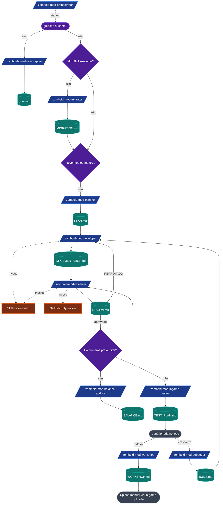

# PIPELINE.md — Skills do Workspace PZ Mods

> Fluxo completo das 10 skills em `.claude/skills/zomboid-*/SKILL.md`.
> Cada skill produz UM artefato com nome fixo, consumido pela próxima.

## Visão geral



## Tabela de hand-off

| Skill | Lê | Produz | Encadeia para |
|---|---|---|---|
| `zomboid-guia-bootstrapper` | `research-findings.md` | `guia.md` | planner ou migrator |
| `zomboid-mod-planner` | `guia.md` + briefing do user | `PLAN.md` | developer |
| `zomboid-mod-developer` | `PLAN.md` + `guia.md` | `IMPLEMENTATION.md` + código | reviewer |
| `zomboid-mod-reviewer` | `PLAN.md`, `IMPLEMENTATION.md`, código | `REVIEW.md` | ingame-tester (aprovado) ou developer (reprovado) |
| `zomboid-mod-migrator` | mod B41 + `guia.md` (breaking changes) | `MIGRATION.md` | planner (replano) ou developer (fixes triviais) |
| `zomboid-mod-ingame-tester` | `IMPLEMENTATION.md`, `PLAN.md` | `TEST_PLAN.md` | usuário roda; depois workshop ou debugger |
| `zomboid-mod-debugger` | `console.txt` + código do mod | `BUGS.md` | developer |
| `zomboid-mod-workshop` | `REVIEW.md` APROVADO + mod | `WORKSHOP.md` | usuário sobe via in-game uploader |
| `zomboid-mod-balance-auditor` | `PLAN.md` + scripts/lua | `BALANCE.md` | reviewer (integra) ou planner (replano) |
| `zomboid-mod-orchestrator` | todos os artefatos | recomendação | a skill apropriada |

## Skills nativas invocadas (Skill tool)
| Native | Quando | Skill que invoca |
|---|---|---|
| `code-review` | Após cada arquivo significativo | developer |
| `code-review` | Análise final do mod inteiro | reviewer |
| `security-review` | Mod tem MP, network, ou input do usuário | reviewer |

## Princípios honrados em todas as skills
1. **Gate de versão.** Toda skill (exceto bootstrapper) começa lendo `guia.md` e abortando se ausente/divergente.
2. **Pesquisa primeiro, escrita depois.** Planner não cita API sem confirmar.
3. **Artefatos com nomes fixos.** Sem ambiguidade entre runs.
4. **Encadeamento explícito.** Cada skill termina com `## Próxima etapa`.
5. **Sem retrabalho.** A próxima lê o artefato; não refaz a análise.
6. **PT-BR ao usuário, inglês no código.**
7. **`[VERIFICAR]` é bloqueador.** Planner marca; developer para.
8. **Sem invenção de API.** Tudo cita fonte (URL ou seção do `guia.md`).

## Como começar (caminho golden)
1. **Workspace novo** → `/zomboid-guia-bootstrapper` (gera `guia.md`).
2. **Mod B41 a migrar** → `/zomboid-mod-migrator`.
3. **Mod novo** → `/zomboid-mod-planner` → confirma briefing → produz `PLAN.md`.
4. **Implementar** → `/zomboid-mod-developer` → produz `IMPLEMENTATION.md`.
5. **Revisar** → `/zomboid-mod-reviewer` → veredito.
6. **(opcional) Auditar números** → `/zomboid-mod-balance-auditor`.
7. **Roteiro de teste** → `/zomboid-mod-ingame-tester` → você roda no jogo.
8. **Se crashou** → `/zomboid-mod-debugger` apontando `console.txt`.
9. **Publicar** → `/zomboid-mod-workshop`.

## Roteador
Em dúvida sobre qual rodar → `/zomboid-mod-orchestrator` te diz pelo estado dos artefatos.

## Sugestão de hook (não aplicada)
Para validar sintaxe Lua localmente após cada Edit/Write, adicione em `~/.claude/settings.json` (precisa de `luac` instalado):
```json
{
  "hooks": {
    "PostToolUse": [
      {
        "matcher": "Edit|Write",
        "hooks": [
          {
            "type": "command",
            "if": "Edit(*.lua)",
            "command": "luac -p \"${tool_input.file_path}\""
          },
          {
            "type": "command",
            "if": "Write(*.lua)",
            "command": "luac -p \"${tool_input.file_path}\""
          }
        ]
      }
    ]
  }
}
```
Esse hook NÃO foi aplicado — apenas sugerido. Verifique se você tem `luac` (do Lua 5.1 ou 5.3, qual a versão de PZ usa internamente) instalado no PATH antes de habilitar.

## Localização das skills
- **Workspace project-level**: `.claude/skills/zomboid-*/SKILL.md` (versionado no monorepo `ZomboidModsMonorepo`).
- Quem clonar o repo recebe o pipeline pronto.
- Os planos individuais (`PLAN.md`, etc.) ficam **fora do git** se você quiser — adicione ao `.gitignore`. Os artefatos por mod podem ser commitados ou não conforme preferência.
